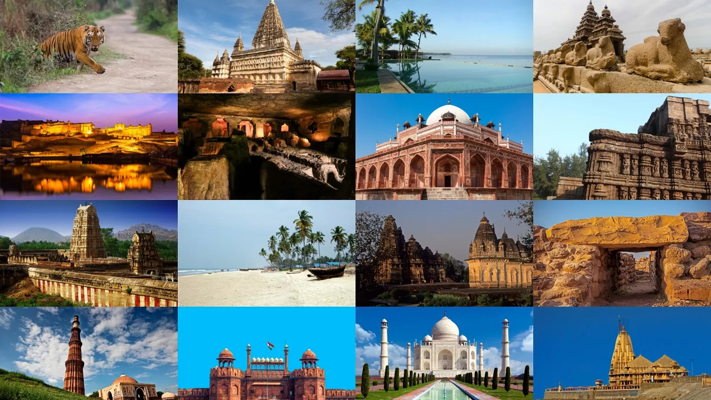

# 🌏✨ Kaleidoscope India – *Wander & Wonder*



### ✨ Explore India’s Landmarks, Cuisine & Culture — All in One Interactive Dashboard

🔗 **Live App:** [Open on Streamlit](https://kaleidoscope-india-wander-and-wonder.streamlit.app/)  
🎞️ **Presentation Slides:** [View on Google Slides](https://docs.google.com/presentation/d/1VUTDyOn7zFxfnJW2zKyOygY1aOUEY5bSRG7W5MrPglg/edit?usp=sharing)

---

## 🧭 Overview

**Kaleidoscope India** is an interactive **Streamlit web application** that unites **travel data, regional cuisine insights, and visual storytelling** — powered by the **Google Drive API** and **PostgreSQL Cloud**.  

The app enables users to:
- Explore India’s iconic **tourist attractions**
- Discover authentic **local dishes**
- Play a fun, data-driven **travel quiz**
- View verified **Google Drive-hosted images** dynamically in real time  

This project showcases end-to-end proficiency in **data engineering, visualization, and cloud-based Streamlit app development**.

---

## 🎯 Objectives

- Build an **interactive travel & cuisine dashboard**  
- Integrate **Google Drive Cloud links** for verified image display  
- Provide dynamic filtering by **region, state, and city**  
- Implement a **gamified quiz** with real-time feedback and leaderboard  
- Use **Neon PostgreSQL Cloud** for secure quiz score storage  

---

## ⚙️ Methodology

| Step | Description |
|------|--------------|
| **1. Data Cleaning & Normalization** | Combined and standardized attraction + cuisine datasets using `pandas` |
| **2. Image Integration** | Automated upload of 300+ verified photos to Google Drive and dynamically linked via Drive API |
| **3. UI/UX Design** | Designed a responsive multi-page Streamlit interface with caching and image optimization |
| **4. Cloud Setup** | Integrated Neon PostgreSQL and SQLAlchemy for persistent storage |
| **5. Performance Optimization** | Implemented thumbnail caching, lazy loading, and concurrent prefetching for faster image load times |

---

## 🧠 Tech Stack

**Languages & Libraries**  
`Python` · `Streamlit` · `Pandas` · `NumPy` · `SQLAlchemy` · `Pillow` · `Requests`

**Cloud & Database**  
`Google Drive API` · `PostgreSQL (Neon Cloud)`

**Highlights**  
- Multi-page architecture (`Homepage`, `Explore`, `Quiz`, `Leaderboard`)  
- Cached & threaded image loading for high performance  
- Secure `.env` configuration for database credentials  
- Clean responsive UI using Streamlit components and CSS styling  

---

## 📊 Key Features

- 🏰 **Explore India:** Filter attractions by region, state, or city  
- 🍛 **Local Cuisine Pairing:** Each attraction links to a matching local dish (Veg/Non-Veg)  
- ☁️ **Cloud Integration:** All images served dynamically from Google Drive  
- 🎮 **Quiz Mode:** 8-question quiz with instant results and visual celebration  
- 🏆 **Leaderboard:** Neon PostgreSQL-powered persistent ranking  
- 📈 **Data Export:** Download combined attraction–dish dataset in one click  

---

## 🚀 Quick Start

```bash
# Clone repository
git clone https://github.com/ruchikagogia1799/Kaleidoscope-India.git
cd Kaleidoscope-India

# Create virtual environment
python -m venv .venv
.venv\Scripts\activate      # Windows
source .venv/bin/activate   # Mac/Linux

# Install dependencies
pip install -r requirements.txt

# Add environment variables
DB_URL=postgresql+psycopg2://<USER>:<PASSWORD>@<HOST>/<DB_NAME>?sslmode=require

# Run locally
streamlit run Homepage.py
